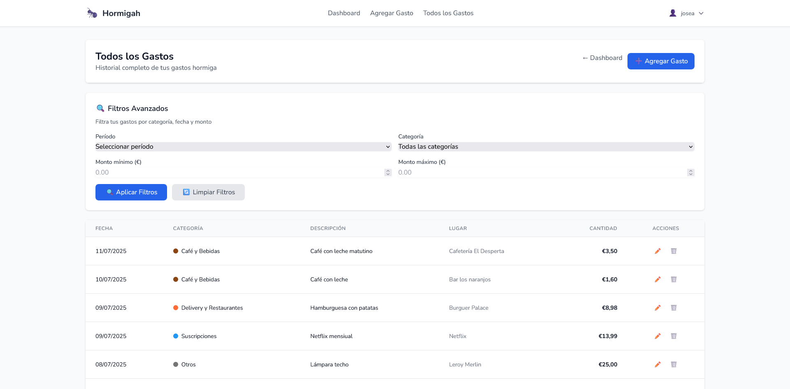
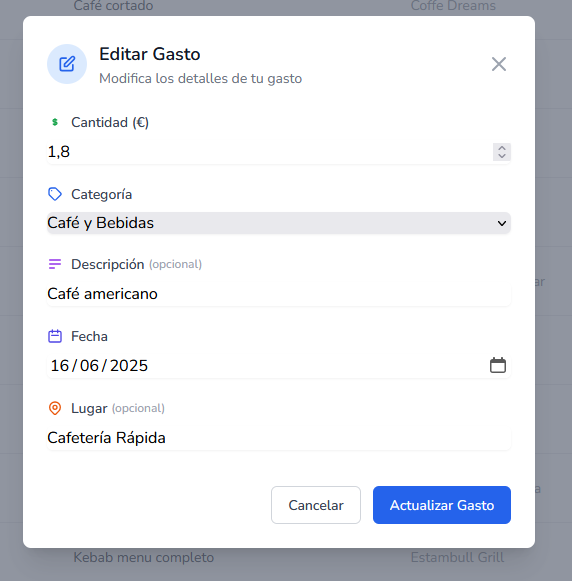
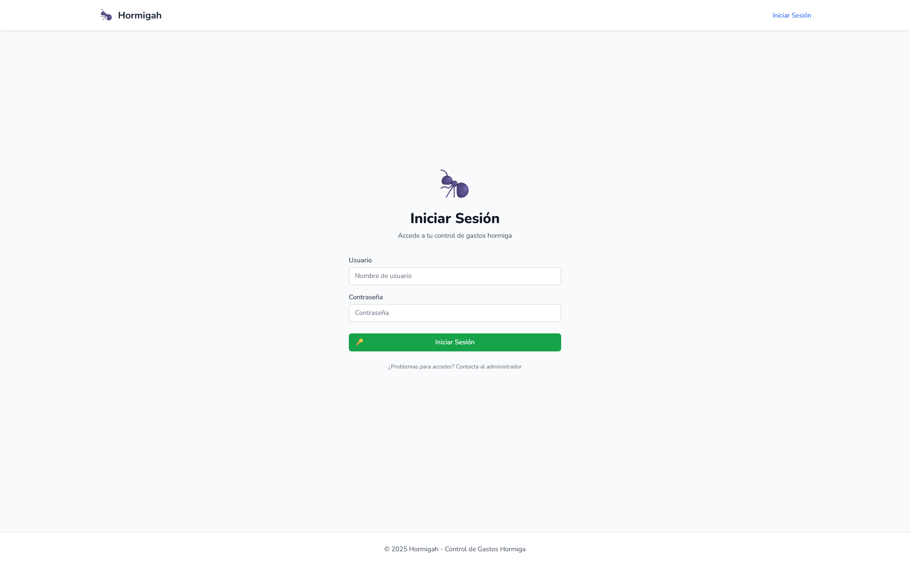

# Hormigah - Control Inteligente de Gastos Hormiga

Una aplicación web moderna para controlar esos pequeños gastos diarios que pasan desapercibidos pero que al final del año suman cantidades importantes. Incluye sistema de automatización con n8n para reportes mensuales inteligentes con IA.


## Concepto: Gastos Hormiga

Los **gastos hormiga** son pequeños desembolsos cotidianos que individualmente parecen insignificantes, pero acumulados representan una parte considerable del presupuesto:

- Café diario: €2,50 × 365 días = €912 al año
- Delivery impulsivo: €12 × 2 veces/semana = €1,248 al año  
- Taxis innecesarios: €7 × 3 veces/semana = €1,092 al año
- Suscripciones no usadas: €9 × 12 meses = €108 al año

**Total: €3,360 al año en gastos "pequeños"**

## 📸 Screenshots

### Dashboard Principal
La vista principal con métricas en tiempo real, gráficos interactivos y lista de gastos recientes.


### Gestión de Gastos
Lista completa de gastos con filtros avanzados y funcionalidad CRUD completa.



### Modales Interactivos (HTMX)
Formularios dinámicos que se abren sin recargar la página.

| Agregar Gasto | Editar Gasto |
|---------------|--------------|
|  |  |

### Perfil de Usuario
Configuración personal y alertas automáticas para reportes mensuales.


### Funcionalidades Clave

#### Acceso y Autenticación
Página de login con diseño limpio y profesional.



#### Gestión de Presupuesto
Modal para configurar presupuesto mensual y alertas automáticas.


#### Diseño Responsive
La aplicación se adapta perfectamente a dispositivos móviles con navegación optimizada y formularios táctiles.

#### Filtros Avanzados
Sistema de filtros inteligentes por período, categoría y monto.


### 📱 Versión Mobile

La aplicación cuenta con un diseño completamente responsive que se adapta perfectamente a dispositivos móviles.

#### Interfaz Principal Mobile
Dashboard optimizado para pantallas pequeñas con navegación intuitiva.


#### Navegación Mobile
Menú hamburguesa con acceso rápido a todas las funcionalidades.


#### Acceso Mobile
Página de login optimizada para dispositivos táctiles.


#### Gestión de Gastos Mobile
Lista de gastos y formularios adaptados para móviles.

<table>
<tr>
<td><strong>Lista de Gastos</strong></td>
<td><strong>Agregar Gasto</strong></td>
</tr>
<tr>
<td></td>
<td></td>
</tr>
</table>

#### Configuración Mobile
Perfil de usuario y configuraciones optimizadas para móvil.


## Características Principales

### Dashboard Inteligente
- Métricas en tiempo real con filtros por período
- Gráficos interactivos (dona y líneas) con Chart.js
- Auto-actualización sin recargar página (HTMX)
- Diseño responsive optimizado para móviles

### Análisis Visual
- Distribución por categorías con colores personalizados
- Tendencias temporales para identificar patrones
- Proyecciones anuales automáticas
- Comparativas mensuales

### Experiencia de Usuario
- Interfaz HTMX sin recargas de página
- Modales dinámicos para operaciones CRUD
- Auto-refresh en listas y métricas
- Navegación fluida entre secciones

### Funcionalidades Avanzadas
- Filtros inteligentes por fecha, categoría y monto
- CRUD completo con validación en tiempo real
- Sistema de categorías con colores personalizados
- Gestión de usuarios con autenticación segura
- Sistema de alertas de presupuesto automatizado
- **API REST**: Endpoints para integración con n8n y otras herramientas
- **Reportes Automatizados**: Generación mensual de reportes con IA
- **Webhooks**: Sistema de notificaciones automáticas

## Tecnologías

### Backend
- **Django 5.2.3**: Framework web robusto
- **PostgreSQL**: Base de datos para desarrollo y producción
- **Python 3.12**: Lenguaje base
- **Gunicorn**: Servidor WSGI para producción

### Frontend
- **HTMX**: Interactividad sin JavaScript complejo
- **Tailwind CSS**: Framework de utilidades CSS
- **Chart.js**: Gráficos interactivos
- **Alpine.js**: Interactividad ligera

### Infraestructura
- **Docker**: Containerización completa
- **Nginx**: Servidor web y proxy inverso
- **n8n**: Automatización de workflows y reportes mensuales con IA

## Instalación

### Requisitos Previos
- Docker y Docker Compose
- Git

### Setup Rápido
```bash
# Clonar repositorio
git clone https://github.com/tu-usuario/hormigah.git
cd hormigah

# Configurar variables de entorno
cp .env.example .env.local

# Iniciar aplicación
docker-compose up -d

# Configurar Django
docker-compose exec web python manage.py migrate
docker-compose exec web python manage.py createsuperuser
```

### Acceso
- **Aplicación principal**: http://localhost:8000/
- **Panel de administración**: http://localhost:8000/admin/

## Estructura del Proyecto

```
hormigah/
├── apps/
│   ├── core/                     # Utilidades base y templates
│   ├── expenses/                 # App principal de gastos
│   │   ├── api/                 # API REST para n8n
│   │   │   ├── authentication.py # Bearer token auth
│   │   │   ├── serializers.py   # DRF serializers
│   │   │   ├── views.py         # API views
│   │   │   └── urls.py          # API endpoints
│   │   ├── models.py            # Category, Expense, Budget
│   │   ├── views.py             # Lógica de negocio web
│   │   ├── forms.py             # Formularios con validación
│   │   ├── utils/               # Utilidades modularizadas
│   │   ├── templates/           # Templates especializados
│   │   └── static/              # CSS y JS específicos
│   └── users/                   # Gestión de usuarios
├── config/                      # Configuración Django
│   ├── settings/                # Settings modulares
│   │   ├── base.py             # Configuración base + API REST
│   │   ├── local.py            # Desarrollo
│   │   └── production.py       # Producción
│   └── urls.py                 # URLs principales + API
├── static/                      # Archivos estáticos globales
├── docker-compose.yml           # Docker desarrollo
├── docker-compose.prod.yml      # Docker producción + n8n
├── Dockerfile                   # Imagen de la aplicación
└── requirements.txt             # Dependencias Python + DRF
```

## Uso de la Aplicación

### Dashboard Principal
- Métricas del período seleccionado
- Gráfico de distribución por categorías  
- Tendencia temporal de gastos
- Lista de gastos recientes

### Gestión de Gastos
- Agregar nuevo gasto (modal HTMX)
- Editar gasto existente (modal HTMX)
- Eliminar gasto (confirmación)
- Ver detalles completos

### Filtros Avanzados
- Por período (Este mes, último mes, últimos 7/30 días)
- Por categoría (Café, Delivery, Transporte, etc.)
- Por rango de fechas personalizado
- Por rango de montos (min/max)

### Sistema de Alertas y Reportes
- Alertas automáticas al alcanzar el 90% del presupuesto mensual
- Configuración por usuario (activar/desactivar)
- **Reportes Mensuales Automatizados**: n8n + OpenAI + Gmail
- **API REST**: Integración completa para herramientas externas
- **Análisis Inteligente**: IA personalizada por usuario y período

## Comandos Útiles

### Desarrollo
```bash
# Iniciar servicios
docker-compose up -d

# Ver logs
docker-compose logs -f web

# Ejecutar migraciones
docker-compose exec web python manage.py makemigrations
docker-compose exec web python manage.py migrate

# Ejecutar tests
docker-compose exec web python manage.py test

# Acceder a Django shell
docker-compose exec web python manage.py shell
```

### Producción con n8n
```bash
# Desplegar aplicación + n8n
docker-compose -f docker-compose.prod.yml up -d

# Ver estado de todos los servicios
docker-compose -f docker-compose.prod.yml ps

# Ver logs específicos
docker-compose -f docker-compose.prod.yml logs web
docker-compose -f docker-compose.prod.yml logs n8n

# Acceder a n8n
# http://tu-dominio.com:5678
```

### API Testing
```bash
# Test endpoint usuarios activos
curl -H "Authorization: Bearer {token}" http://localhost:8000/api/users/active/

# Test endpoint usuario completo  
curl -H "Authorization: Bearer {token}" http://localhost:8000/api/users/1/complete/

# Verificar documentación API
curl http://localhost:8000/api/docs/
```

## API REST

### Endpoints Disponibles

#### Listar Usuarios Activos
```
GET /api/users/active/
Authorization: Bearer {N8N_API_TOKEN}
```

Retorna usuarios que:
- Tienen presupuesto configurado
- Tienen alertas por email activadas  
- Han registrado gastos en los últimos 30 días

#### Obtener Datos Completos de Usuario
```
GET /api/users/{id}/complete/
Authorization: Bearer {N8N_API_TOKEN}
```

Retorna datos completos incluyendo:
- Información del usuario y presupuesto
- Historial completo de gastos
- Resúmenes mensuales y por categorías
- Estadísticas y tendencias

#### Documentación Interactiva
- **Swagger UI**: http://localhost:8000/api/docs/
- **OpenAPI Schema**: http://localhost:8000/api/schema/

### Autenticación API
- **Desarrollo**: Token fijo en settings
- **Producción**: Token seguro via variables de entorno
- **Tipo**: Bearer Token personalizado

## Automatización con n8n

### Workflow de Reportes Mensuales

El sistema incluye un workflow completo de n8n que:

1. **Schedule Trigger**: Se ejecuta automáticamente el día 1 de cada mes a las 9:00 AM
2. **Detección de Usuarios**: Obtiene lista de usuarios activos via API REST
3. **Análisis Individual**: Para cada usuario obtiene sus datos completos
4. **Filtrado Temporal**: Procesa únicamente los gastos del mes anterior
5. **Análisis con IA**: GPT-3.5-turbo genera reporte personalizado
6. **Envío por Email**: Gmail con diseño HTML profesional

### Características del Reporte IA

- **Análisis Temporal Preciso**: Solo analiza el mes anterior, no el actual
- **Métricas Financieras**: Total gastado, porcentaje del presupuesto usado
- **Desglose por Categorías**: Análisis detallado de cada tipo de gasto
- **Recomendaciones Personalizadas**: Sugerencias específicas del usuario
- **Diseño Profesional**: Email HTML con identidad visual corporativa

### Configuración n8n

```javascript
// Filtrado temporal en nodo Code
const allExpenses = $input.all()[0].json.complete_history.all_expenses || [];
const now = new Date();
const prevMonth = new Date(now.getFullYear(), now.getMonth() - 1, 1);
const nextMonth = new Date(now.getFullYear(), now.getMonth(), 1);

const expensesFiltered = allExpenses.filter(expense => {
    const expenseDate = new Date(expense.date);
    return expenseDate >= prevMonth && expenseDate < nextMonth;
});
```

### Variables de Entorno Requeridas

```bash
# API REST
N8N_API_TOKEN=tu-token-seguro-aqui

# Webhooks (existente)
N8N_WEBHOOK_TOKEN=tu-webhook-token-aqui

# n8n URLs
N8N_BASE_URL=http://localhost:5678
```

### Funcionalidades Destacadas
- **Auto-Refresh Inteligente**: Las listas se actualizan automáticamente
- **Interfaz Moderna**: Modales HTMX sin cambiar de página
- **Responsive Design**: Optimizado para todos los dispositivos
- **Sistema de Automatización Completo**: n8n + API REST + IA
- **Reportes Mensuales Automatizados**: Análisis personalizado con GPT
- **Integración Gmail**: Emails HTML profesionales automáticos